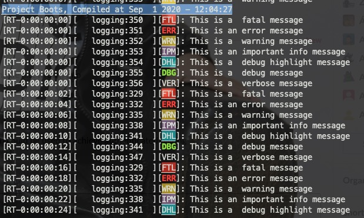

<!-- Author: Zhen Fu -->

# Log System

## Introduction

Logging is very important for developing embedded products. This is especially true for connection-based wireless products because the use of breakpoints will probably result in dropped connections, whereas issues can be easily addressed by walking through the log.

This example introduces a simple implementation of logging on EFR32 based devices. The key point of the example code is to introduce a way to classify the log into different levels, where each level of log has its own identifier.

## Features

### Logging Interfaces

The example code supports both [SEGGER's Real Time Transfer (RTT)](https://www.segger.com/products/debug-probes/j-link/technology/about-real-time-transfer/) and Serial Terminal via UART (VCOM).

### Fields in the Logging

By default, each piece of logging contains below information.

- Time - it's the relative time from device boots, if it's fed by the wall clock information, then the time will become the absolute time.
- Location - the file and line information where the logging located will be recorded into the logging.
- Level - it supports 7 levels logging, identified by color. See below picture and table.

| Type                   | Color             | Note                                                       |
| ---------------------- | ----------------- | ---------------------------------------------------------- |
| Fatal (highest level)  | Backgroud Red     | Non-maskable, configurable if to assert or not when called |
| Error                  | Red               | Maskable                                                   |
| Warning                | Backgroud Yellow  | Maskable                                                   |
| Important Information  | Backgroud Magenta | Maskable                                                   |
| Debug Highlight        | Backgroud Magenta | Maskable                                                   |
| Debug                  | Backgroud Cyan    | Maskable                                                   |
| Verbose (lowest level) | White             | Maskable                                                   |

### Filtering

It's runtime configurable to set a threshold while log messages with higher level than or equal to the threshold will be sent to the logging interface, whereas log messages with lower level than the threshold will be ignored and discarded. For example, if the threshold is set to _Important Information_, then logging messages with _Fatal_, _Error_, _Warning_ and _Important Information_ levels will be sent to the logging interface, the others will be ignored.

### Memory Usage

Currently, it supports full featured and lightweight modes. In full featured mode, logging.c is necessary to be built and a dedicated buffer for storing the logging message will be allocated statically. For lightweight mode, logging.c is not necessary to be built and all the functionalities are mostly provided as macros, there is no memory needs to be allocated and logging message is passed to the underlying functions directly. The way to store the message depends on the implementation of the underlying functions.

From the functionality perspective, the only difference between these 2 modes is that the lightweight mode doesn't support runtime threshold configuration, which can only be hardcoded at compiling time.

## Setting Up

### Integrated to GSDK 2.7

1. Create a new _SoC-Empty_ example project in Simplicity Studio.

2. Download the logging project into your SoC-Empty project space.

3. Open the logging_config.h and modify below settings if needed.

   - LOGGING_CONFIG - see [Memory Usage](#memory-usage)
   - TIME_ON - if you need to add time information to the log, set to 1. Because it utilizes the sl_sleep_timer service, you need to set macro - SL_SLEEPTIMER_WALLCLOCK_CONFIG to 1 in sl_sleeptimer_config.h file.
   - LOGGING_BUF_LENGTH - size of the dedicated buffer for the full featured mode.
   - LOGGING_INTERFACE - decide which interface or both the logging will be sent to.
   - FATAL_ABORT - if assert the program when a fatal logging is called.
   - LOGGING_LEVEL - set the threshold for logging levels in the lightweight mode.

4. Add _INIT_LOG(0xff);_ to the initialization code place and include "logging/logging.h" to the file you want to use the logging functionality.

5. Add your own logging to the project.

6. Build and flash the image to your board, connect your board with the proper interface to view the log.

### Integrated to GSDK 3.0

If using the RTT as the logging interface, follow the same instruction as above - [Integrated to GSDK 2.7](#integrated-to-gsdk-2.7).

If using serial port as the logging interface, it's needed to add 2 steps between step 3 and 4 of [Integrated to GSDK 2.7](#integrated-to-gsdk-2.7).

- Open the \${PROJECT*NAME}.slcp file and install the \_IO Stream: USART* and and _IO Stream: Retarget STDIO_ components.

- Set the SL_BOARD_ENABLE_VCOM to 1 in sl_board_control_config.h

## Get the Project

The logging project can be found in [Github](https://github.com/silabs-kevin/logging).
